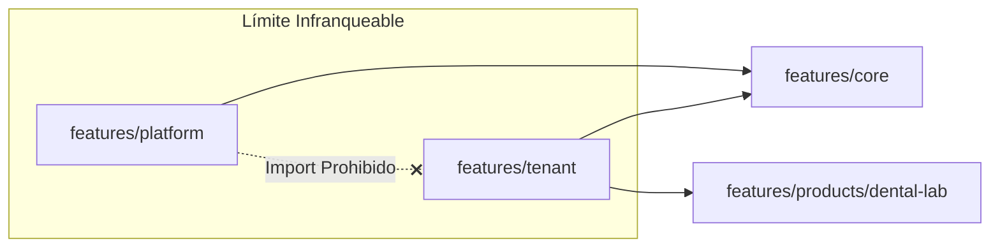

# 🏗 Architecture

## Overview

CinloLabs está construido sobre una arquitectura full-stack cloud moderna basada en **Next.js 16 (App Router)** y **Supabase**, estructurada mediante el patrón **Feature-Driven Architecture (FDA)** y separación estricta de dominios.

El diseño arquitectónico prioriza:
- **Aislamiento riguroso entre dominios** (verificado automáticamente en pipelines de CI).
- **Separación de responsabilidades en 3 capas** (Controladores → Servicios → Repositorios).
- **Seguridad multi-tenant nativa** tanto a nivel de aplicación como en la base de datos (PostgreSQL Row Level Security).
- **Escalabilidad modular** para incorporar nuevas especialidades o portales sin alterar módulos estables.

---

# 🧩 High Level Architecture

CinloLabs opera sobre una infraestructura serverless moderna:

```text
                        Usuario / Odontólogo
                                 |
                                 v
                         Next.js 16 Application
                                 |
         ┌───────────────────────┼───────────────────────┐
         |                       |                       |
         v                       v                       v
    App Router             Server Actions         Client Components
         |                       |                       |
         └───────────────────────┼───────────────────────┘
                                 |
                                 v
                          Supabase Platform
         ┌───────────────────────┼───────────────────────┐
         |                       |                       |
         v                       v                       v
  Authentication          PostgreSQL + RLS            Storage
```

---

# 🗺️ Patrón de Diseño: Feature-Driven Architecture (FDA)

En lugar de organizar el código por capas técnicas globales horizontales (`components/`, `hooks/`, `services/`), CinloLabs agrupa su lógica de negocio por módulos verticales orientados a características dentro del directorio `features/`.

```text
features/mi-modulo/
├── components/       # UI de presentación del dominio
├── hooks/            # Hooks de estado local
├── services/         # Servicios con reglas de negocio del dominio
├── lib/              # Repositorios y adaptadores
└── types/            # Tipos y contratos TypeScript
```

---

# 🛡️ Separación Estricta de Dominios y Verificación en CI

Para evitar acoplamiento indeseado en una plataforma multi-tenant modular, los módulos funcionales se dividen en límites estrictos:

- **`platform/`** — Lógica exclusiva del super-administrador SaaS (gestión de tenants, analíticas globales, auditoría).
- **`tenant/`** — Dashboard y lógica del laboratorio cliente.
- **`products/`** — Módulos verticales especializados (ej. `dental-lab`).
- **`core/`** — Primitivas compartidas, componentes de UI puros sin lógica de negocio y utilidades transversales.

## Regla de Oro Enforced por CI (`check-boundaries`)
El código del dominio `tenant` **nunca puede importar** del dominio `platform` ni viceversa. Esta regla es verificada de forma automatizada mediante el script `scripts/check-boundaries.js` en cada pipeline de integración continua:



---

# 🧱 Capas Arquitectónicas (SRP)

Cada módulo de feature implementa una separación interna en 3 capas de responsabilidad:

## 1. Controladores Delgados (Thin Controllers)
Ubicados en `app/api/`. Actúan como adaptadores HTTP:
- Reciben y validan la petición HTTP.
- Verifican la sesión y autenticación del usuario.
- Delegan inmediatamente el procesamiento al servicio de negocio.

## 2. Servicios de Negocio (Business Services)
Ubicados en `features/*/services/`. Contienen el núcleo de reglas y orquestación:
- Validan transiciones de estado y reglas del dominio dental.
- Orquestan notificaciones por correo (`EmailService` / Resend) e integraciones externas.

## 3. Repositorios Desacoplados (Repository Pattern)
Ubicados en `features/*/lib/*.repository.ts`. Aíslan el acceso físico a los datos:
- Implementan una interfaz clara de persistencia.
- Permiten migrar entre capas de almacenamiento o realizar pruebas unitarias en memoria sin modificar la lógica de negocio ni la interfaz de usuario.

---

# ⚡ Prevención de Hydration Mismatches (SSR vs CSR)

Al utilizar Next.js SSR junto con almacenamiento de cliente (ej. preferencias del tenant o carritos en `localStorage`), CinloLabs previene discrepancias de hidratación (`Hydration Mismatch`):
- Hidratación estricta de estado en el navegador mediante hooks encapsulados en `useEffect`.
- Dynamic Scoping para aislar identificadores de persistencia local entre entornos y tenants.
