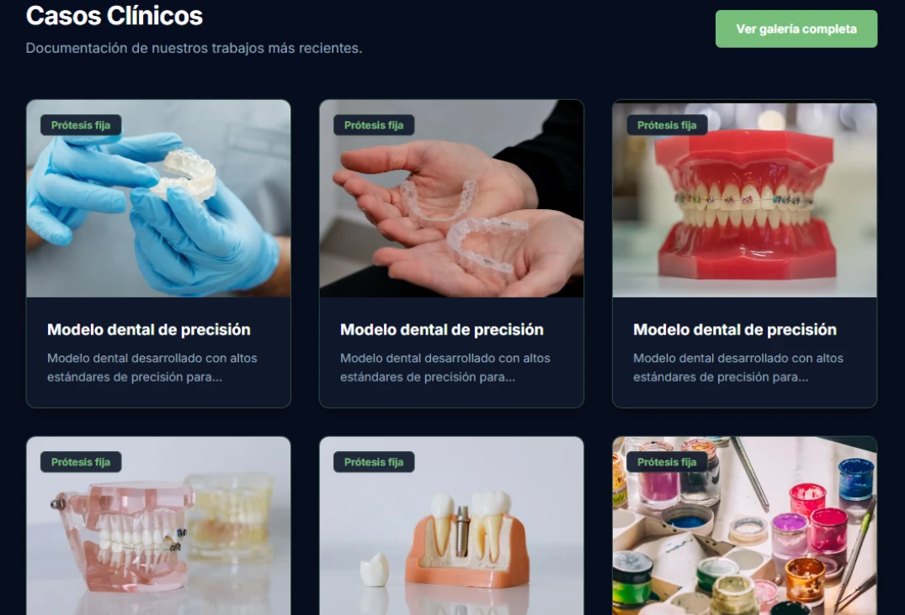
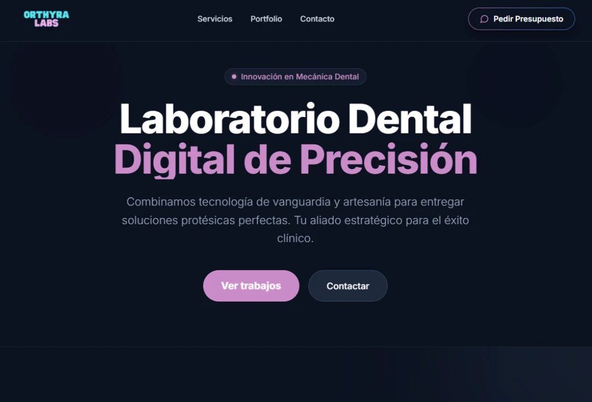
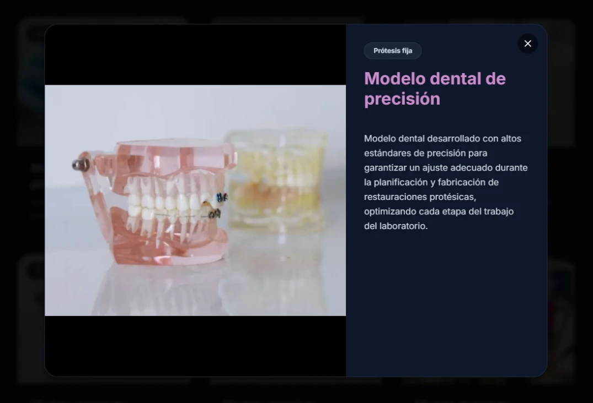
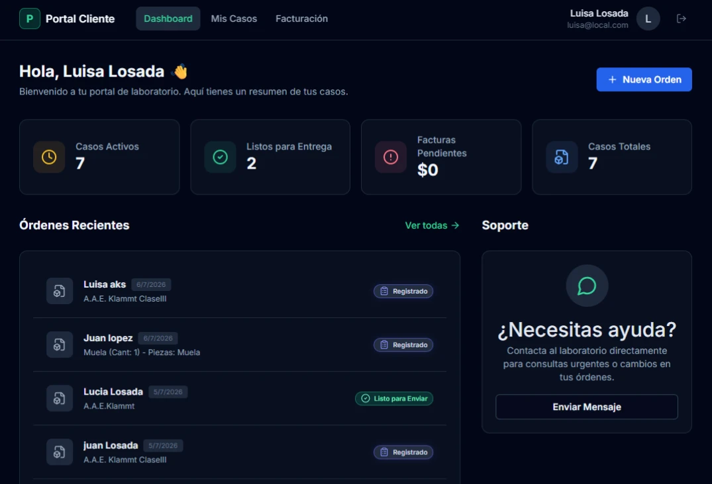
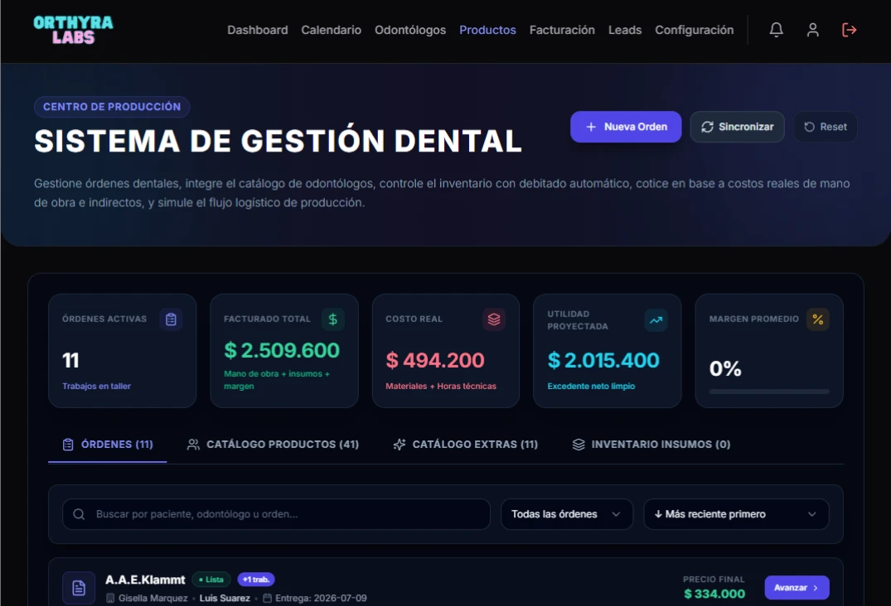

# 📝 Changelog

Todas las versiones notables de **CinloLabs** son registradas en este documento.

El proyecto se rige por versionado semántico y evolución modular continua.

---

# [1.3.0] - 2026-06-15

### 🛡️ Seguridad Multi-Tenant & Aislamiento
- **Row Level Security (RLS):** Activación y validación integral de políticas RLS en PostgreSQL a través de Supabase para todas las tablas transaccionales (`orders`, `patients`, `dentists`).
- **Suite de Aislamiento Multi-Tenant:** Incorporación de pruebas automatizadas en CI (`tenant-isolation`) para certificar que ningún laboratorio acceda a datos de otros tenants.
- **Auditoría Extendida:** Módulo de auditoría de acciones sensibles (`features/audit`).

---

# [1.2.0] - 2026-05-10

### 🎨 Landing Pages Públicas por Laboratorio & Theming
- **Sitio Público por Tenant (`/lab/[tenant-slug]`):** Páginas promocionales autogestionadas para cada laboratorio dental cliente.
- **Motor de Theming Dinámico:** Selección y configuración entre **4 plantillas visuales premium**, con ajustes personalizados de paleta de colores y tipografía desde el panel administrativo.
- **Portafolio Interactivo:** Galería para exhibición de casos protésicos y tecnologías del laboratorio.

  

  

  

---

# [1.1.0] - 2026-04-01

### 🦷 Portal de Odontólogos Dedicado
- **Carga Autónoma de Órdenes:** Espacio web independiente (`features/portal`) donde clínicas y odontólogos pueden solicitar trabajos con especificaciones clínicas claras.
- **Monitoreo en Tiempo Real:** Seguimiento del progreso de cada orden en las etapas de producción del laboratorio.
- **Comprobantes y PDF:** Generación en el navegador de órdenes y remitos en PDF (`jspdf` + `html2canvas`).

  

---

# [1.0.0] - 2026-02-15

### 🚀 Lanzamiento Core en Producción
- **Panel del Laboratorio (Tenant Dashboard):** Gestión integral de órdenes protésicas (coronas, prótesis removible, ortodoncia) con fechas límite y estados de producción.
- **Directorio de Pacientes y Odontólogos:** Gestión unificada de fichas clínicas e historiales.
- **Arquitectura Feature-Driven (FDA):** Estructuración en módulos (`platform`, `tenant`, `products/dental-lab`, `core`).
- **Verificación en CI (`check-boundaries`):** Pipeline automatizado que prohíbe importaciones cruzadas entre dominios.

  

