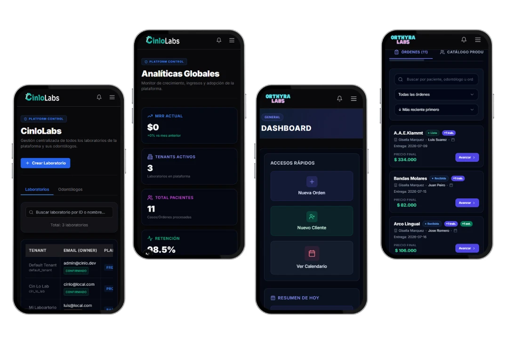

# ✨ Features

CinloLabs está compuesto por módulos especializados que cubren de manera integral tanto la gestión operativa interna de los laboratorios de mecánica dental como su interacción digital con clínicas odontológicas y la administración SaaS centralizada.

Cada módulo fue diseñado en el marco de nuestra **Feature-Driven Architecture (FDA)**, garantizando alta cohesión funcional, rendimiento optimizado y estricta seguridad multi-tenant.

---

# 🛠 Panel del Laboratorio (Tenant Dashboard)

  

Es el núcleo operativo donde el administrador del laboratorio y los técnicos gestionan el día a día.

## Características Principales:
- **Tablero Centralizado de Órdenes:** Visualización rápida del estado global del laboratorio (trabajos pendientes, en producción, listos para entrega o entregados).
- **Gestión Completa de Órdenes de Trabajo:**
  - Registro ágil de nuevas órdenes con asociación de paciente, odontólogo solicitante, tipo de trabajo (prótesis fija, removible, ortodoncia, coronas) y color.
  - Flujo de estados dinámicos y seguimiento de fechas compromiso de entrega.
- **Directorio de Pacientes:** Expediente centralizado que agrupa todos los trabajos y el historial protésico asociado a cada paciente.
- **Cartera de Odontólogos:** Administración de los profesionales clientes del laboratorio, con historial de trabajos e información de contacto.

---

# 🦷 Portal de Odontólogos

  

Un portal web seguro y exclusivo para los odontólogos clientes del laboratorio, eliminando la necesidad de consultas telefónicas o por chat.

## Características Principales:
- **Carga Autónoma de Órdenes:** Los odontólogos pueden registrar solicitudes de nuevos trabajos protésicos indicando especificaciones clínicas claras y adjuntando notas o referencias.
- **Seguimiento en Tiempo Real:** Visibilidad clara del progreso de cada orden (ej. *Recibido en laboratorio*, *En prueba de estructura*, *Listo para despacho*).
- **Historial y Comprobantes:** Consulta histórica de todos los trabajos solicitados y descarga de recibos o comprobantes de entrega.

---

# 🎨 Landing Pages Públicas y Sistema de Theming

  

Cada laboratorio cliente en CinloLabs cuenta con su propio sitio web público promocional, personalizable y autogestionado.

## Características Principales:
- **Sitio Público por Tenant:** Presentación profesional del laboratorio accesible bajo su propia ruta o dominio (`/lab/[tenant-slug]`).
- **Sistema de Theming Integrado:** Soporte nativo para elegir y personalizar entre **4 plantillas visuales premium**, ajustando paletas de color y tipografía desde el panel del laboratorio.
- **Portafolio de Especialidades:** Galería interactiva para mostrar casos de éxito, tecnologías utilizadas (CAD/CAM, impresiones 3D, zirconio) y captura directa de nuevos clientes.

---

# 🏢 Administración Global SaaS (Platform Superadmin)

  

Módulo exclusivo para los propietarios de la plataforma (`features/platform`), rigurosamente aislado del código de los laboratorios clientes.

## Características Principales:
- **Gestión Multi-Tenant:** Alta, suspensión y configuración de laboratorios clientes.
- **Observabilidad y Auditoría:** Métricas en tiempo real sobre adopción, volumen de órdenes globales, logs de auditoría (`features/audit`) y monitoreo del estado de servicios (`features/observability`).
- **Planes y Suscripciones:** Control centralizado de planes de facturación e integración con proveedores de pago (`features/billing`).

---

# 📄 Generación de Comprobantes PDF y Exportaciones

- **Órdenes en PDF:** Generación del lado del cliente y servidor de comprobantes profesionales listos para imprimir (`jspdf` + `html2canvas`).
- **Exportación de Datos:** Exportación instantánea de listados de órdenes, pacientes y métricas a formatos Excel/CSV (`xlsx`) para análisis contable o respaldos.

---

# 📱 Diseño 100% Responsive y Experiencia Móvil

  

- **Interfaz Adaptable Multi-Dispositivo:** Todos los paneles del sistema y las landings públicas están optimizados para operar con la misma fluidez en smartphones, tablets y computadoras de escritorio.
- **Acceso en la Mesa de Trabajo:** Los técnicos pueden cambiar el estado de producción de un trabajo protésico desde su móvil al instante.
