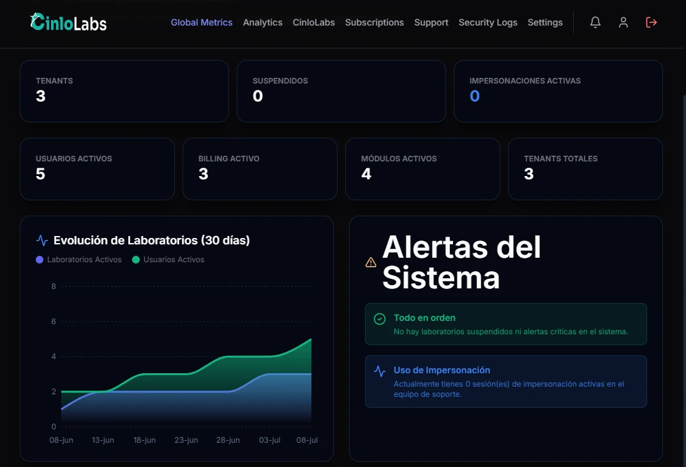
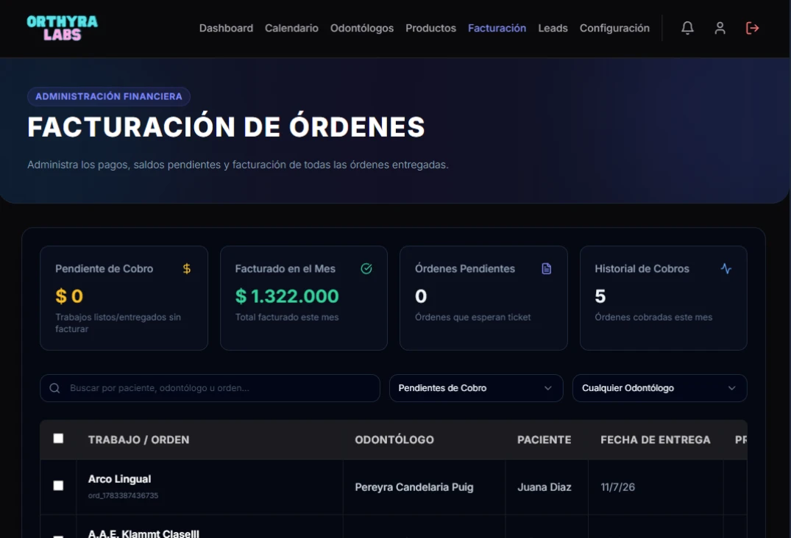
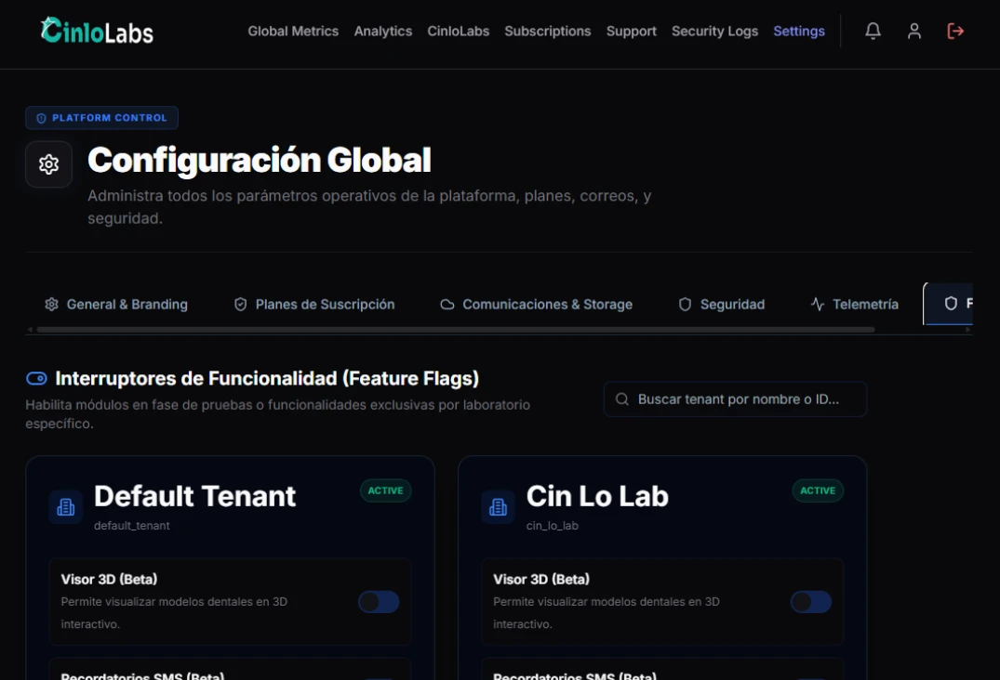
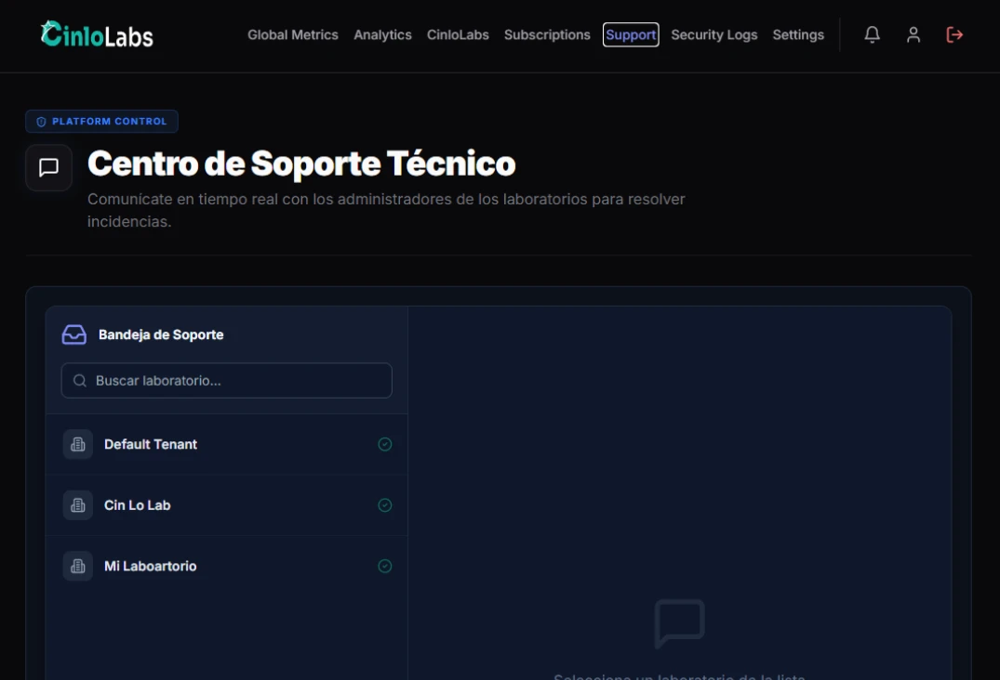

# 📖 Product Overview

## ¿Qué es CinloLabs?

**CinloLabs** es una plataforma SaaS B2B especializada en digitalizar la gestión operativa integral de laboratorios de mecánica dental y optimizar su comunicación comercial y productiva con odontólogos y clínicas dentales.

La plataforma centraliza la administración de órdenes de trabajo, pacientes, odontólogos clientes, estados de producción, facturación y sitios web promocionales en un ecosistema unificado y seguro en la nube.

<p align="center">
  
</p>

---

# 🎯 Objetivo

El objetivo principal de CinloLabs es erradicar la fragmentación operativa en los laboratorios dentales, reemplazando métodos manuales (planillas, cuadernos, chats dispersos) por un flujo de trabajo digital trazable, profesional y colaborativo.

Mediante CinloLabs, los laboratorios ganan control operativo absoluto, mientras que los odontólogos obtienen una experiencia de usuario moderna y transparente para solicitar y monitorear sus trabajos protésicos.

---

# 👥 Segmentos de Usuarios y Roles

CinloLabs está estructurado para atender tres niveles de usuarios diferenciados, cada uno con experiencias y portales adaptados a sus necesidades:

```text
┌──────────────────────────────────────────────────────────────────┐
│                      CINLOLABS PLATFORM                          │
├──────────────────────────────────────────────────────────────────┤
│                                                                  │
│  ┌───────────────────────┐         ┌──────────────────────────┐  │
│  │   Tenant Admin /      │         │   Odontólogos Clientes   │  │
│  │     Operadores        │         │   (Portal del Cliente)   │  │
│  └───────────┬───────────┘         └────────────┬─────────────┘  │
│              │                                  │                │
│              └────────────────┬─────────────────┘                │
│                               ▼                                  │
│                 [ Laboratorio Tenant (SaaS) ]                    │
│                                                                  │
├──────────────────────────────────────────────────────────────────┤
│  ┌────────────────────────────────────────────────────────────┐  │
│  │             Superadmin / Platform Admin                    │  │
│  │   (Gestión de Tenants, Analytics, Auditoría, Facturación)  │  │
│  └────────────────────────────────────────────────────────────┘  │
└──────────────────────────────────────────────────────────────────┘
```

## 1. Laboratorios de Mecánica Dental (Tenant Admin & Operadores)

Es el usuario principal de la aplicación (`features/tenant`):
- **Gestión de Órdenes:** Creación, recepción y actualización del estado de trabajos de laboratorio (Prótesis, Coronas, Ortodoncia, etc.).
- **Trazabilidad de Pacientes:** Historial clínico y seguimiento de trabajos por paciente.
- **Directorio de Odontólogos:** Gestión de cuentas de odontólogos asociados al laboratorio.
- **Personalización del Sitio Web:** Configuración de la landing page pública del laboratorio (`features/tienda` / Theming) para mostrar portafolio, especialidades y datos de contacto.

## 2. Odontólogos y Clínicas Dentales (Portal de Odontólogos)

Es el cliente de cada laboratorio (`features/portal`):
- **Carga Directa de Pedidos:** Solicitud estructurada de nuevos trabajos indicando paciente, tipo de prótesis, color y fechas límite.
- **Monitoreo en Tiempo Real:** Visualización transparente de la etapa de producción del trabajo en el laboratorio.
- **Historial y Comprobantes:** Acceso centralizado a órdenes previas y reportes de entrega.

<p align="center">
  
</p>

## 3. Administradores de la Plataforma (Superadmin / Platform Admin)

Es el equipo propietario del SaaS (`features/platform`):
- **Administración Multi-Tenant:** Alta, baja, monitoreo y configuración de laboratorios clientes.
- **Analytics & Observabilidad:** Monitoreo de métricas globales de uso, salud del sistema y logs de auditoría.
- **Planes y Suscripciones:** Gestión de planes de facturación y límites de capacidad por laboratorio.

<p align="center">
  
</p>

<p align="center">
  
</p>

---

# 🔄 Flujo de Valor del Producto

El ciclo de vida de un trabajo dentro de CinloLabs sigue un flujo claro y trazable de extremo a extremo:

1. **Solicitud / Recepción:** El odontólogo carga una orden de trabajo desde el Portal, o el laboratorio la registra directamente en el panel.
2. **Planificación:** El laboratorio asigna prioridad, revisa especificaciones clínicas y establece la fecha prevista de entrega.
3. **Producción:** A medida que avanza la confección, los técnicos actualizan las etapas (ej. *En proceso*, *Prueba*, *Terminado*), notificando al odontólogo en su portal.
4. **Entrega y Facturación:** Se genera el comprobante final de entrega, cerrando el ciclo con total trazabilidad histórica.
